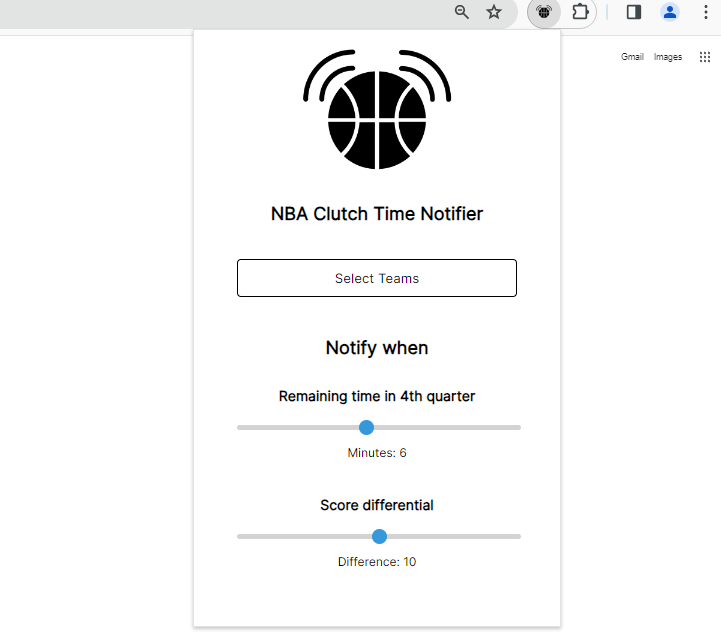

# NBA Clutch Time Notifier

Provides real-time notifications for close and competitive NBA games in the final quarter

Don't have the time to watch full NBA games but also don't want to miss the thrilling endings of close matches? NBA Clutch Time Notifier will always alert you about live games that become close in the 4th quarter. Users can select teams to receive notifications from and adjust parameters that control their notifications. Alerts will pop up in the corner of the screen as a chrome notification.

#### Chrome web store link: https://chromewebstore.google.com/detail/nba-clutch-time-notifier/kenhbmdplilkiabfkjknnfliacbionof

### IMPORTANT
Make sure notifications for Google Chrome are turned on for your device.

Windows users: Settings > System > Notifications & Actions > Check if Google Chrome is toggled on

MacOS users: System Preferences > Notifications & Focus > Google Chrome > Allow Notifications

### About
- Built with HTML, CSS, and JavaScript
- Utilizes ESPN API to gather live game data and Chrome Storage API to store user input values

